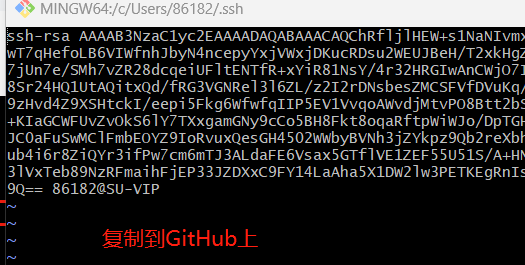
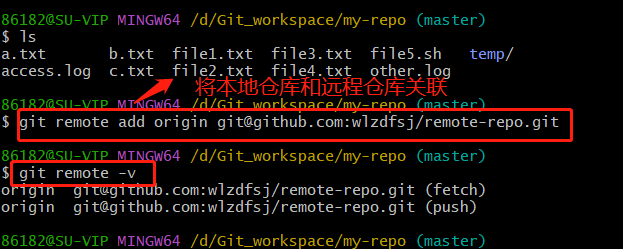
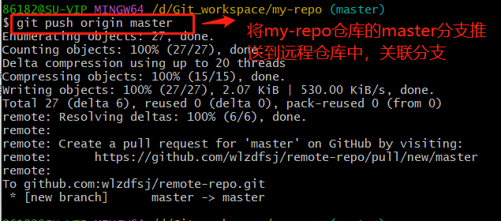
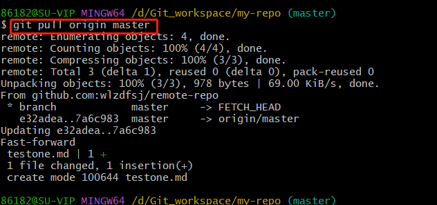

# GitHub
#### 克隆远程仓库，使用ssh协议

1. 配置ssh

公钥上传：

配置成功：

**注意：如果是第一次配置ssh，并没有修改默认文件名，此时配置成功
如果不是第一次配置，而是新建的一个保存秘钥的文件，则需要多加一步;**
需要创建一个config文件，执行tail -5 config得到五行内容，将这五行内容添加到文件里面
克隆远程仓库到本地：

此时对这个仓库进行修改数据，并不会影响远程仓库，因为没有提交远程仓库中
#### 本地仓库和远程仓库是俩个独立仓库，不会相互影响，想要同步俩个仓库，需要用到俩个命令：
* git push &emsp;//把本地仓库的修改推送到远程仓库
* git pull &emsp;//把远程仓库的修改拉取到本地仓库

此时可以在远程仓库看到新的数据：

#### 关联本地仓库和远程仓库
* git remote add origin git@github.com:wlzdfsj/remote-repo.git
表示关联本地my-repo这个仓库和远程remote-repo仓库
* git remote -v 
查看当前仓库对应的远程仓库别名和地址，origin为别名

* git push origin master &emsp;//master为本地分支
把本地仓库的master分支推送给远程仓库的master分支,关联本地和远程的分支

* git pull origin master:master
将远程仓库的master分支拉取到本地master分支，进行合并（远程仓库已修改数据）

合并以后，在本地仓库就可以看见新增的文件，拉取成功！！
