### Git常用操作
注意在GitBash中使用的是Linux命令
##### 1. 配置信息
>1. git config --global user.name "su meng ying"
--省略：本地配置，只对本仓库有效
--global:全局配置，所有仓库有效
--system：系统配置，对所有用户有效

>2. git config --global user.email 18206186278@163.com  &emsp;//配置邮箱

>3.  git config --global credential.helper store&emsp;//保存用户名和密码，不用每次都配置
>4.  git config --global --list &emsp;//查看配置的用户名和密码

##### 2. 新建版本库(仓库Repository)  &emsp;//看做目录，里面存在很多文件
 >mkdir Git_workspace&emsp;//在当前目录下创建新文件夹
 >cd Git_workspace&emsp;//进入Git_workspace目录
git init&emsp;//此时可以新建仓库了
 ls -a&emsp;//查看所有文件包括隐藏文件
**git init my-repo&emsp;//创建本地仓库my-repo**
 **git clone 远程仓库地址&emsp;//将远程仓库复制到本地**

##### 3.添加和提交文件
**注意：git commit -am "添加暂存并提交"**：这个命令可以完成添加暂存和提交俩个动作
文件工作状态：工作区，暂存区，本地仓库
1.  echo "这是第一个文件" > file1.txt  &emsp;//新建文件file.txt，并写入数据
2. cat file1.txt  &emsp;//查看文件内容
3. git status&emsp;//查看文件状态
 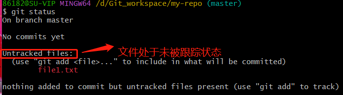
4.  git add file1.txt &emsp;//将文件添加到暂存区

5.  git commit -m "第一次提交"&emsp;//提交文件到本地仓库
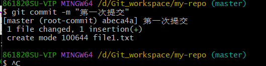
**注意：只会把暂存区文件提交到本地仓库，工作区不会**
6. git add *.txt  &emsp;//一次将多个一.txt结尾文件添加到暂存区
7.  git add .&emsp;//将当前文件夹下面所有文件添加到暂存区
8. git commit &emsp;//若不指定-m,则进入vim编辑器
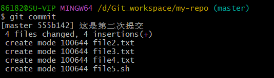
9.  git log&emsp;//查看提交日志
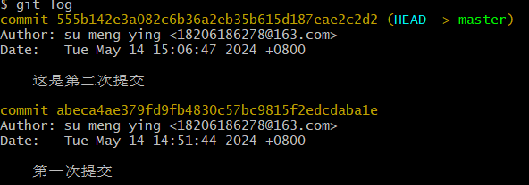
 git log --oneline&emsp;//可以看到提价版本ID
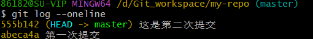
10. git reset &emsp;//用于回退版本，退回之前提交的状态
三种模式：
* git reset --soft  &emsp;//回退到某一个版本，并保留工作区、暂缓区所有修改内容
* git reset --hard&emsp;//回退到某一个版本，并丢弃工作区、暂缓区所有修改内容
* git reset --mixed&emsp;//回退到某一个版本，并保留工作区，但是丢弃暂缓区所有修改内容

回退版本：
**1. git reset --soft b9fe287**&emsp;//b9fe287为提交的版本ID，**将此ID上方提交信息回退**，比如写入a1c4fd8,则1a77c87这条提交信息不存在
此时再查看提交信息，发现提交信息缺少一条
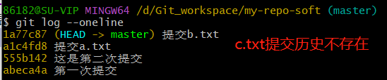
注意：此时，工作区和暂存区c.txt文件还存在
 git ls-files：查看暂存区文件
 **2.  git reset --hard 1a77c87**
 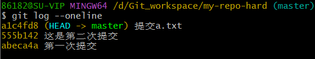
注意：此时，工作区和暂存区b.txt文件都不存在
**3. git reset abeca4a** &emsp;//使用默认mixed
此时工作区还存在a.txt，但是暂存区不存在

**如果误操作删除数据内容，可以回溯：
使用 git reflog 查看操作历史记录
再使用git reset --hard ID 回到误操作之前**

####  git diff查看工作区、暂存区、本地仓库内由于文件修改导致差异
* git diff 查看工作区和暂存区文件差异
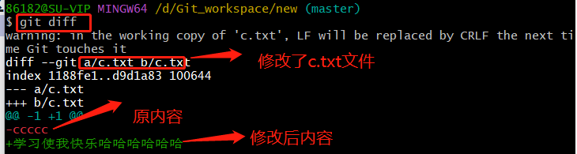
在工作区修改了c.txt后，未提交到暂存区，用git diff 查看到修改的信息，此时工作区和暂存区存在差异。
当把修改后的c.txt上传到暂存区，此时没有差异
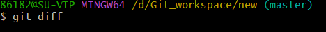
* git diff HEAD查看工作区和本地仓库差异
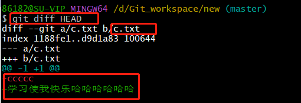
由于c.txt没有提交到仓库，所以本地工作区与仓库存在差异
* git diff --cached 查看暂存区与仓库之间差异
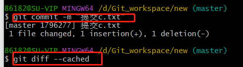
将c.txt提交到仓库之后，暂存区和仓库之间文件不存在差异
* git diff ID1 ID2 比较俩个版本库之间差异
**HEAD表示当前分支的最新提交**
* git diff HEAD~ HEAD  &emsp;//比较当前版本与上一个提交版本之间差异
* git diff HEAD~2 HEAD  &emsp;//比较当前版本与之前第二个版本之间差异

#### git rm 删除文件
注意：删除文件一定要将操作记录上传到版本库
* 法1： 1. 先在工作区删除a.txt  rm a.txt
    2. 再将暂存区文件删除 git add a.txt
    3. git commit -m "......" 从版本库删除
    
* 法2：1. git rm b.txt    &emsp;//直接将b.txt从工作区、暂存区删除
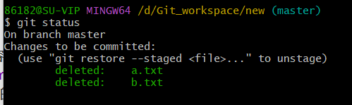

 * 2. git commit -m "删除a.txt和b.txt文件"&emsp;//将版本库中文件a.txt和b.txt删除
 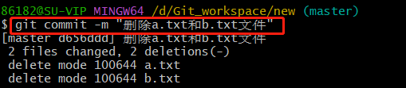
 **此时文件才彻底删除**
 
* git rm --cached file &emsp;//把文件从版本库中删除，但是保留在当前工作区中
* git rm -f  文件名&emsp;//强制删除文件

#### .gitignore忽略文件
将一些文件忽略，不要上传到版本库中，如:
* 系统或者软件自动生成的文件
* 编译生成的文件
* 日志文件、缓存文件
* 涉及身份密码口令等敏感信息文件
1.创建俩个文件 access.log， other.log
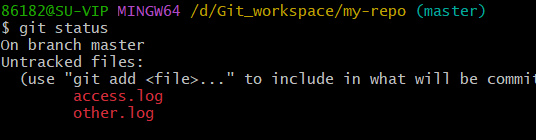
2. echo access.log > .gitignore 将access.log添加到.gitignore中，此时access.log将不存在未追踪状态
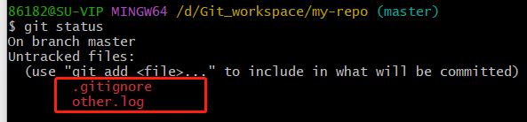
3. 将本地文件提交到仓库
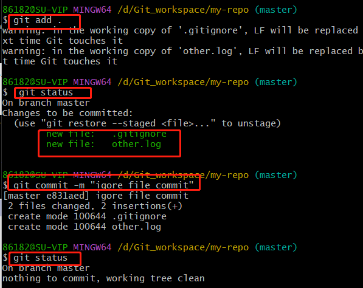
4. 发现access.log没有被上传到仓库
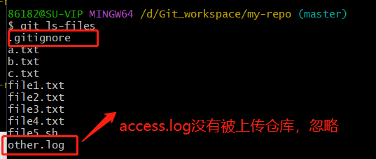
5.通过编辑.gitignore文件，添加*.log,即忽略所有日志文件
注意：如果忽略日志文件上传到版本库，但是之前已经提交了一个日志文件other.log,
那此时若修改日志文件，系统能发现本地与仓库文件的差异吗？
可以的，因为.gitignore生效前已经上传仓库的日志文件，所以对other.log不起作用

注意：git不会将空文件夹纳入版本控制中，即创建的空文件，看不到提交状态
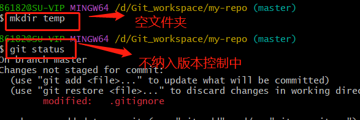

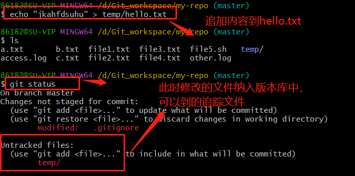
如果将temp文件夹中加入到.gitignore文件中，忽略temp文件夹
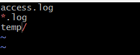
M:表示.gitignore文件被修改了
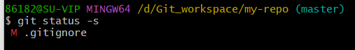
由于temp被写入忽视文件，所有里面所有文件不会被追踪
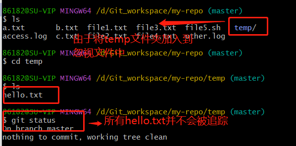

**.gitignore文件匹配规则**
>* *.a &emsp;//忽略所有的.a文件
* !lib.a &emsp;//在第一条规则基础上，并不忽略lib.a文件
* /T0D0 &emsp;//只忽略当前目录下的T0D0文件
* bulid/&emsp;//忽略任何目录下名为build文件夹 
* doc/*.txt &emsp;//忽略doc文件夹下面的所有txt文件
* doc/**/*.pdf &emsp;//忽略doc目录下所有子目录里面的txt文件

#### 其他涉及到的命令Linux
1. echo "这是第一个文件" > file1.txt  
2. cat file1.txt  &emsp;//查看文件内容
3. cp -rf my-repo my-repo-soft &emsp;//复制文件夹
4. ls -ltr&emsp;//查看当前目录下文件的详细信息
5. rm a.txt&emsp;//删除a.txt
6.  rm -rf 文件夹名 &emsp;//强制删除文件夹(目录)
7. echo access.log > .gitignore &emsp;//将access.log写入到 .gitignore文件中，此时 .gitignore文件内容包含access.log
8.  echo "修改log" >>other.log  &emsp;//表示将“修改log”追加到other.log文件中
9.  git rm *.txt

